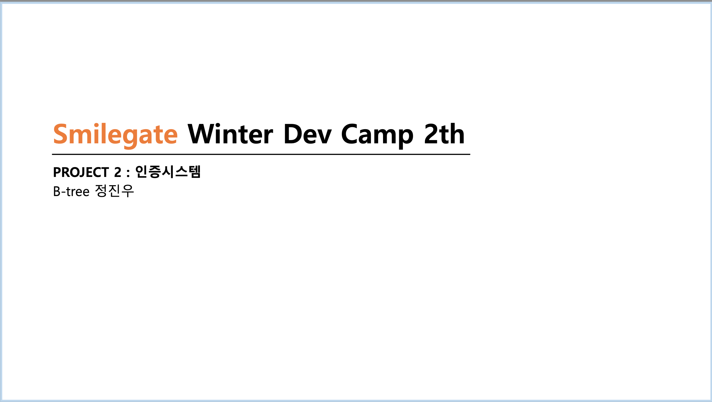
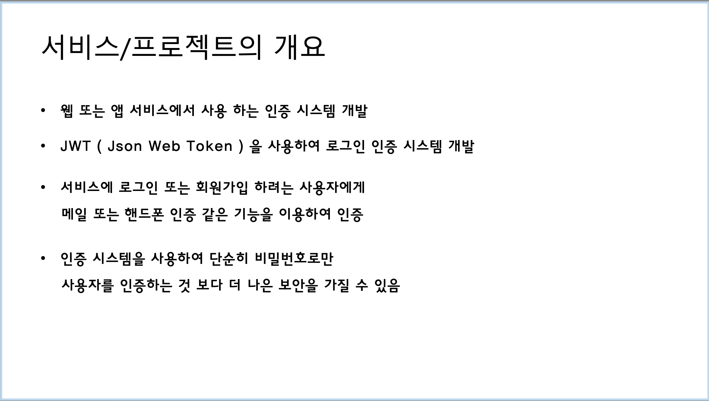
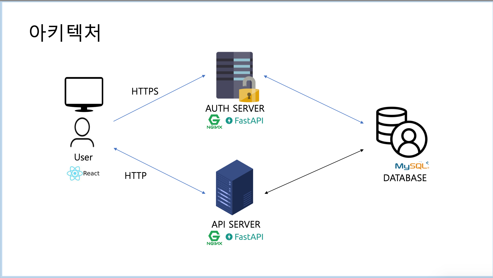
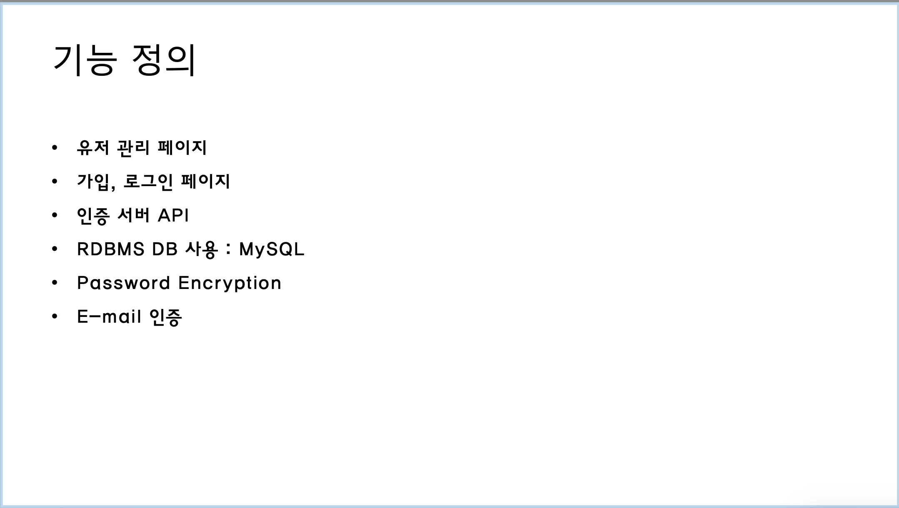
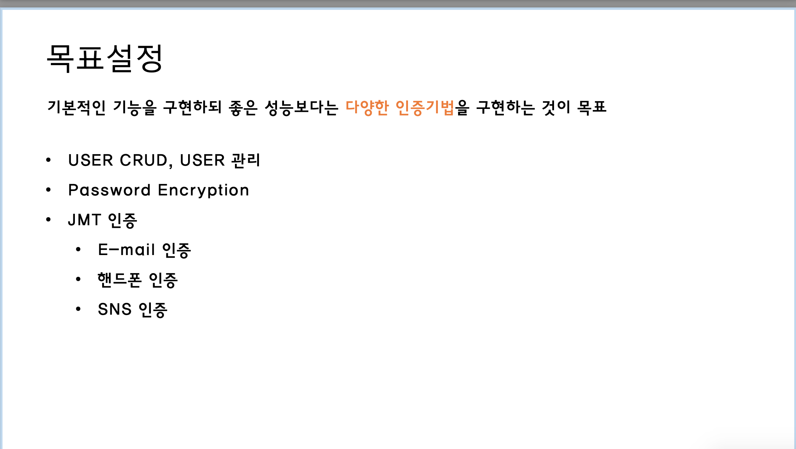

# Auth-system
Smilegate Winter Dev Camp 2th, Personal Project : Auth System
> The goal is to implement <strong>various authentication techniques</strong> rather than good performance.
---
### Objective Setting Documents

---

## Targeted Features
- User Management Page
- Sign Up and Login page form
- Auth Server API
- RDBMS DB use : MySQL
- Password Encryption
- JWT authentication
    - E-mail
    - Phone
    - SNS

## Description
* Develop authentication system using 
<strong>JWT and others</strong>
* Apply <strong>Password Encryption</strong>
* Sign Up with generated token
* Manage USER CRUD
> Using JWT and Password Encrption makes Authentication system more secure

## Enviornment
* Docker Ubuntu 22.04.1 LTS ( Latest )
* Server Backend : Uvicorn
* Server Frontend : Nodejs (npm)

## FrameWork
* Frontend : [React][React]
* Backend : [Fastapi][Fastapi]
* Database : [MySQL]

## 목표설정 문서와 다르게한점
1. 아키텍쳐
    - HTTP 통신으로 진행하였다.
    - AUTH, API 서버를 따로 나누지 않았다.
    - NGINX 서버를 사용하지 않았다.
2. JWT 인증
    - Email, 핸드폰, SNS인증 구현하지 못헀다.

# 주요기능 명세

1. 유저 관리 페이지
    - 유저들을 관리하는 특별한 페이지는 만들지 않았다.
2. 가입 페이지
    - 유저들이 회원가입 하는 페이지
    - name, email, password, password2를 입력받는다
    - email과 password가 REST API 통신을 통해 backend로 전달된다.
    - DB확인후 없으면 인증 페이지로 넘어간다.
3. 인증 페이지
    - 인증페이지에서 적절한 인증 토큰과 이메일을 통해 인증되지 못하면
    - 회원가입이 완료된 후 DB에 is_active값이 false로 설정되어 로그인이 불가능하다.
    - 인증 되었을 경우 is_active값을 true로 바꿔준다.
    - 인증 토큰을 이메일로 보내서 누르면 인증되게 끔 하려고 했으나 하지 못했다.
4. 로그인 페이지
    - 유저들이 로그인 하는 페이지
    - email과 password가 REST API 통신을 통해 form형식으로 backend로 전달된다.
    - DB확인후 없으면 JWT인 access_token과 refresh_token을 같이 발급한다 localstorage에 저장.
    = access_token이 있으면 profile 페이지를 방문할 때 제대로 된 콘텐츠를 볼 수 있다.
    - access_token의 시간을 짧게하여 만료될떄마다 refresh_token을 통해 access_token을 재발급 해주도록 구현하려 헀으나 못했다.
    - access_token과 refresh_token을 쿠키형태로 넘기려고 했으나 못했다.
5. 프로필 페이지
    - login후 access_token을 localstorage에 소유하고 있으면 접속가능하다.
    - 사용자 정보를 보여준다.

    

---

## 구현하고 싶은 기능
1. email을 통해 인증
2. 3rd party (google, etc..)를 통해 로그인 지원 해보고 싶다.
3. 더많은 prontend page 구현
4. redis를 사용해서 token access를 빠르게 처리해보고싶다.
5. refresh_token을 통해 access_token이 만료되었을때 재발급 되게끔 해보고 싶다.
6. auth, api 서버를 분리해보고 싶다.

---
## 개발관련 과정에서 궁금했던 부분 
    
- Frontend에서 Backend로 OAuthPasswordBearer를 하기 위하여 formdata를 넘기는데, 그냥 json으로 넘겨서 토큰을 받으면 되면 안되나요? OAuthPasswordBearer의 장점이 궁금합니다.
    - 구현방법의 차이.
- token을 넘겨서 localstorage에 넘기는것 까지는 확인했는데
localstorage의 key를 보면 고정으로 되어있는데 클라이언트마다 다른 localstorage를 사용하는건가요? 클라이안트마다 독립적으로 사용이 가능한 것인가 궁금합니다
    - localstorage는 도메인 단위로사용, 브라우저 창 단위인 세션보다 조금더 크다.
- 대부분의 jwt는 refreshtoken을 함께 사용한다고 들었는데
refreshtoken도 같이 로컬스토리지에 보낸다음에 저장해서 사용하면 되는건가요? 만약 그렇다면 refreshtoken과 accesstoken은 어떨때 비교하여 어떻게 backend에서 frontend에 accesstoken을 재발급해주나요?
    -  관련 문서가 많다 찾아보길 권유
- react에서 새창이 열리는 것과 같은 다른 세션을 사용하게    됬을때의   로그인이 유지되게끔 하려면 어떻게 해야하나요?
    - AccessToken이 있으면 확인 절차를 거쳐서 자동적으로 유지가 된다

---
-  ++[12/24]
backend에서 어떻게 frontend로 인증토근 정보를 쿠키로 넘기는가?

- 3rd party login 구현이 어떤 로직으로 돌아가는지 궁금하다.
- 토큰 재발급 절차를 잘 모르곘다 ..

[React]: https://github.com/facebook/react "Go react github"
[Fastapi]: https://github.com/tiangolo/fastapi "Go fastapi github"
[Mysql]: https://www.mysql.com/ "Go Mysql"